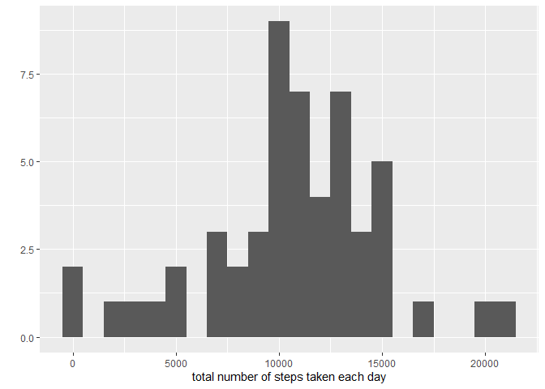
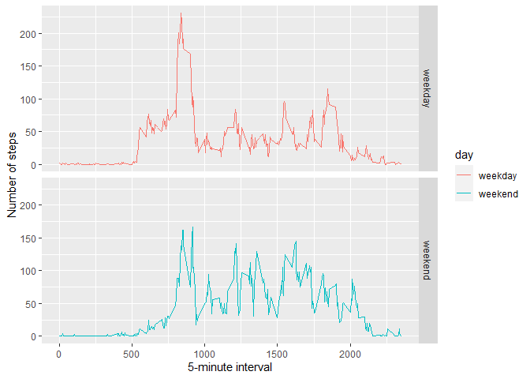

Reproducible Research- Project1
================
Ranjan Kumar
12/04/2020

### Loading and preprocessing the data

``` r
unzip(zipfile="repdata_data_activity.zip")
data1 <- read.csv("activity.csv")
```

### What is mean total number of steps taken per day?

``` r
library(ggplot2)
```

    ## Warning: package 'ggplot2' was built under R version 3.6.3

``` r
steps_total <- tapply(data1$steps, data1$date, FUN=sum)
qplot(steps_total, binwidth=1000, xlab="total number of steps taken each day")
```

    ## Warning: Removed 8 rows containing non-finite values (stat_bin).

<!-- -->

``` r
mean(steps_total, na.rm=TRUE)
```

    ## [1] 10766.19

``` r
median(steps_total, na.rm=TRUE)
```

    ## [1] 10765

### What is the average daily activity pattern?

``` r
library(ggplot2)
avg_activity <- aggregate(x=list(steps=data1$steps), by=list(interval=data1$interval),
                      FUN=mean, na.rm=TRUE)
ggplot(data=avg_activity, aes(x=interval, y=steps)) +
    geom_line() +
    xlab("5-minute interval") +
    ylab("average number of steps taken")
```

<!-- -->

#### On average across all the days in the dataset, the 5-minute interval contains the maximum number of steps?

``` r
avg_activity[which.max(avg_activity$steps),]
```

    ##     interval    steps
    ## 104      835 206.1698

### Imputing missing values

There are many days/intervals where there are missing values (coded as
`NA`). The presence of missing days may introduce bias into some
calculations or summaries of the data.

``` r
missing <- is.na(data1$steps)
# How many missing
table(missing)
```

    ## missing
    ## FALSE  TRUE 
    ## 15264  2304

All of the missing values are filled in with mean value for that
5-minute interval.

``` r
# Replace each missing value with the mean value of its 5-minute interval
fill.value <- function(steps, interval) {
    filled <- NA
    if (!is.na(steps))
        filled <- c(steps)
    else
        filled <- (avg_activity[avg_activity$interval==interval, "steps"])
    return(filled)
}
filled.data <- data1
filled.data$steps <- mapply(fill.value, filled.data$steps, filled.data$interval)
```

Now, using the filled data set, let’s make a histogram of the total
number of steps taken each day and calculate the mean and median total
number of steps.

``` r
total.steps <- tapply(filled.data$steps, filled.data$date, FUN=sum)
qplot(total.steps, binwidth=1000, xlab="total number of steps taken each day")
```

<!-- -->

``` r
mean(total.steps)
```

    ## [1] 10766.19

``` r
median(total.steps)
```

    ## [1] 10766.19

Mean and median values are higher after imputing missing data. The
reason is that in the original data, there are some days with `steps`
values `NA` for any `interval`. The total number of steps taken in such
days are set to 0s by default. However, after replacing missing `steps`
values with the mean `steps` of associated `interval` value, these 0
values are removed from the histogram of total number of steps taken
each day.

### Are there differences in activity patterns between weekdays and weekends?

First, let’s find the day of the week for each measurement in the
dataset. In this part, we use the dataset with the filled-in values.

``` r
weekday.or.weekend <- function(date) {
    day <- weekdays(date)
    if (day %in% c("Monday", "Tuesday", "Wednesday", "Thursday", "Friday"))
        return("weekday")
    else if (day %in% c("Saturday", "Sunday"))
        return("weekend")
    else
        stop("invalid date")
}
filled.data$date <- as.Date(filled.data$date)
filled.data$day <- sapply(filled.data$date, FUN=weekday.or.weekend)
```

Now, let’s make a panel plot containing plots of average number of steps
taken on weekdays and weekends.

``` r
averages <- aggregate(steps ~ interval + day, data=filled.data, mean)
ggplot(averages, aes(interval, steps,color=day)) + geom_line() + facet_grid(day ~ .) +
    xlab("5-minute interval") + ylab("Number of steps")
```

<!-- -->
